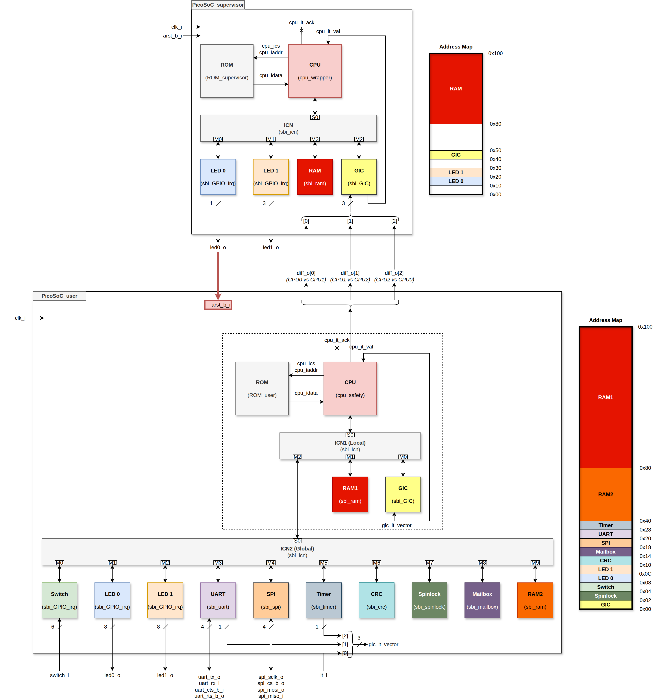
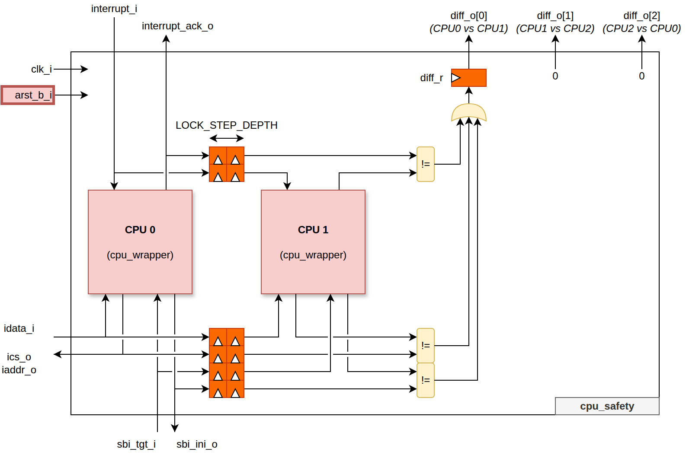
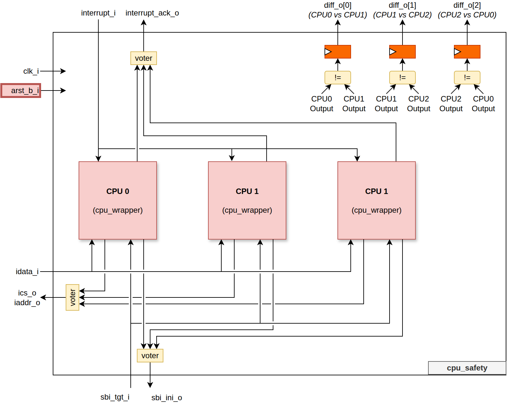

<!--
  README GENERATION INSTRUCTIONS (for the next regeneration run)
  ----------------------------------------------------------------
  This README follows the common Asylum IP model. Regenerate it from the
  sources, never from the previous README text alone.

  Sources of truth (in priority order):
    1. hdl/*.vhd            : entities, generics, ports, packages
    2. hdl/csr/*.hjson      : register map (regtool); *_csr.md/.h are generated
    3. <IP>.core            : VLNV (name), filesets, targets, depends, revisions
    4. mk/targets.txt       : target list shown by `make help`; mk/defs.mk
    5. sim/, syn/, esw/, boards/ : testbenches, constraints, software
  Section order (keep it, same headings in every IP):
    CI badge / Title + one-line description + VLNV / Table of Contents /
    Introduction (Key Features) / Block Diagram / Top-Level (Parameters,
    Ports, Instantiation Example) / HDL Modules / Register Map /
    Verification / Synthesis / Design Notes (optional) /
    Directory Structure / Dependencies
  Rules:
    - Language: English. Tables: Parameters = Name|Type|Default|Description,
      Ports = Name|Direction|Type|Description (grouped by interface).
    - Register Map: link to the generated hdl/csr/<X>_csr.md (plus the
      .hjson source and _csr.h header); never copy register tables here.
    - Top-Level = sbi_* wrapper if present, else the entity used by the
      `default` target, else the main entity (libraries: list packages).
    - Write "This IP has no software-visible registers." / "No dedicated
      synthesis target ..." instead of removing a section.
    - Keep still-accurate hand-written content (ISA tables, results,
      images) in "Design Notes"; drop anything not backed by the sources.
    - Block diagram: doc/<NAME>.drawio (NAME = 4th field of the VLNV),
      top entity box with generics on top, inputs left, outputs right,
      bus interfaces as bold arrows, internal blocks colour-coded
      (CSR yellow, FIFO/memory green, core logic blue, external grey).
      Update it whenever ports/generics/sub-blocks change.
    - Do not edit generated files (hdl/csr/*_csr.*) or the CI badge URL.
-->
[](https://github.com/deuskane/asylum-soc-picosoc/actions/workflows/ci.yml)

# asylum-soc-picosoc

**Small SoC with OpenBlaze8 or WardRV CPU(s), SBI interconnect, GPIO, UART, SPI, GIC, timer, CRC, spinlock, mailbox and RAMs, plus an optional supervisor SoC and lock-step / TMR CPU safety.**

VLNV: `asylum:soc:PicoSoC:3.3.1`

## Table of Contents

1. [Introduction](#introduction)
2. [Block Diagram](#block-diagram)
3. [Top-Level](#top-level)
4. [HDL Modules](#hdl-modules)
5. [Register Map](#register-map)
6. [Verification](#verification)
7. [Synthesis](#synthesis)
8. [Design Notes](#design-notes)
9. [Directory Structure](#directory-structure)
10. [Dependencies](#dependencies)

## Introduction

PicoSoC is the reference system of the Asylum project. It integrates the Asylum IPs around one CPU model selected by the `CPU_MODEL` generic (`"OpenBlaze8"`, the 8-bit PicoBlaze-3 clone, or `"WardRV_fsm"`, the RV32I processor), with an 8-bit SBI bus and a 256-byte address space. It is split in two domains:

- the **user SoC** (`PicoSoC_user`): 1 to `NB_CPU` CPU clusters (CPU with its safety wrapper, program ROM, local interconnect, local GIC and local RAM) sharing a global interconnect with the peripherals (switches, two LED banks, UART, SPI, timer, CRC16, spinlock, mailbox, shared RAM);
- the **supervisor SoC** (`PicoSoC_supervisor`, optional with `SUPERVISOR`): a single CPU that receives the safety mismatch flags of the user CPU through its GIC, and controls the user SoC reset and a status LED bank.

`PicoSoC_top` adds the board level: reset polarity and resynchronisation, clock divider (`FSYS` to `FSYS_INT`), input polarities, SPI IO pads and a debug output multiplexer. The firmware of both domains is compiled from [esw/](esw/) by FuseSoC generators into `ROM_user` / `ROM_supervisor`.

### Key Features

- CPU selection per build: `OpenBlaze8` (`sbi_OpenBlaze8`) or `WardRV_fsm` (`sbi_WardRV_fsm`) through `cpu_wrapper`
- Multi-core user SoC (`USER_NB_CPU`), each CPU with its own ROM, GIC and RAM1, `mhartid` = CPU index (WardRV)
- Safety wrapper `cpu_safety`: `"none"`, `"lock-step"` (CPU1 delayed by `LOCK_STEP_DEPTH` cycles and compared) or `"tmr"` (3 CPUs, majority vote); sticky mismatch flags `diff_o`
- Fault injection: one instruction bit of each redundant CPU can be flipped from `inject_error_i`
- Supervisor SoC reacting to mismatches by resetting the user SoC (firmware [esw/supervisor.c](esw/supervisor.c), TMR-aware variant)
- Peripherals: 3 x `sbi_GPIO_irq`, `sbi_uart` (CTS/RTS, configurable FIFOs), `sbi_spi` (up to 8 IO lanes, pads), `sbi_timer`, `sbi_crc` (CRC16 Modbus, polynomial `0xA001`), `sbi_spinlock`, `sbi_mailbox`, `sbi_GIC`, `sbi_ram`
- Two-level SBI interconnect (`sbi_icn`): ICN1 local to each CPU, ICN2 global with `NB_CPU` masters
- Firmware: GPIO identity, full peripheral test (`user.c`), Modbus RTU server, multi-core hello world with spinlock, XModem, supervisor
- Simulation with GHDL (generic and UVVM Modbus testbenches, optional SPI flash model), FPGA builds for NanoXplore NG-MEDIUM (nxmap) and Digilent Basys (ISE)

## Block Diagram

Diagram: [doc/PicoSoC.drawio](doc/PicoSoC.drawio) (open with diagrams.net or the VS Code Draw.io extension). The detailed hand-drawn views are in [doc/assets/picosoc.drawio](doc/assets/picosoc.drawio) (see [Design Notes](#design-notes)).

- `PicoSoC_top` resynchronises the reset (`sync2dffrn`), divides `clk_i` by `FSYS/FSYS_INT` (`clock_divider`), adapts the input polarities and instantiates `PicoSoC_user`, `PicoSoC_supervisor` (if `SUPERVISOR`) and the SPI pads (`obuf`, `iobuf`).
- In each user CPU cluster, `cpu_safety` fetches from `ROM_user` and accesses ICN1: GIC (`0x00`) and RAM1 (`0x80`) are local, every other address goes to ICN2.
- ICN2 decodes the shared peripherals: SWITCH, LED0, LED1, CRC, mailbox, SPI, UART, timer, spinlock and RAM2.
- The local GIC collects `it_user_i`, the UART and the timer interrupts and drives the CPU interrupt.
- `cpu_safety.diff_o` (3 sticky mismatch flags, OR-ed over the `NB_CPU` clusters into `PicoSoC_user.diff_o`) drives the supervisor GIC; the supervisor GPIO `USER_ARST` (LED0) is the user SoC reset and its `LED_DIFF` bank (LED1) is output on `led_diff_o`. Without supervisor, `diff` goes directly to `led_diff_o`.

## Top-Level

Top-level entity: **`PicoSoC_top`** ([hdl/PicoSoC_top.vhd](hdl/PicoSoC_top.vhd)), library `asylum`, component declared in `asylum.PicoSoC_pkg`. It is the toplevel of all `emu_*` targets and the DUT of both testbenches.

It is also the toplevel of the `default` target of [PicoSoC.core](PicoSoC.core) (marked "DON'T RUN": the ROMs come from the firmware generators).

### Parameters

| Name | Type | Default | Description |
|------|------|---------|-------------|
| `FSYS` | positive | `50_000_000` | Frequency of `clk_i` (Hz) |
| `FSYS_INT` | positive | `50_000_000` | Internal frequency (Hz); clock divider ratio `FSYS/FSYS_INT`; UART `CLOCK_FREQ` |
| `RESET_POLARITY` | string | `"low"` | Polarity of `arst_i`: `"high"` / `"low"` |
| `DEBUG_ENABLE` | boolean | `True` | `True`: debug multiplexer on `debug_o` and UART TX copy on `debug_uart_tx_o`; `False`: UART RX state on `debug_o` |
| `CPU_MODEL` | string | `"OpenBlaze8"` | `"OpenBlaze8"` or `"WardRV_fsm"` (any other value fails the `cpu_wrapper` assertion); same default as the core parameter and the sub-entities |
| `USER_NB_CPU` | natural | `1` | Number of CPU clusters in the user SoC |
| `USER_ICN_TARGET_SEL` | string | `"or"` | User ICN response selection: `"or"` / `"mux"` |
| `USER_ICN_MASTER_SEL` | string | `"fix"` | User ICN2 arbitration: `"fix"` / `"roundrobin"` |
| `USER_RAM1_DEPTH` | natural | `128` | Local RAM1 size in bytes (up to 128) |
| `USER_RAM2_DEPTH` | natural | `64` | Shared RAM2 size in bytes (up to 64) |
| `USER_NB_SWITCH` | positive | `8` | Width of `switch_i` |
| `USER_NB_LED0` | positive | `8` | Width of `led0_o` |
| `USER_NB_LED1` | positive | `8` | Width of `led1_o` |
| `USER_BAUD_RATE` | integer | `115200` | UART baud rate |
| `USER_UART_DEPTH_TX` | natural | `0` | UART TX FIFO depth |
| `USER_UART_DEPTH_RX` | natural | `0` | UART RX FIFO depth |
| `USER_SPI_DEPTH_CMD` | natural | `0` | SPI command FIFO depth |
| `USER_SPI_DEPTH_TX` | natural | `0` | SPI TX FIFO depth |
| `USER_SPI_DEPTH_RX` | natural | `0` | SPI RX FIFO depth |
| `USER_SPI_NB_IO` | natural | `8` | Number of SPI IO pads (`spi_io_io`) |
| `USER_SAFETY` | string | `"lock-step"` | `"none"` / `"lock-step"` / `"tmr"` |
| `USER_LOCK_STEP_DEPTH` | natural | `2` | Delay (cycles) between CPU0 and CPU1 in lock-step mode |
| `USER_FAULT_INJECTION` | boolean | `True` | Enable `inject_error_i` |
| `USER_FAULT_POLARITY` | string | `"low"` | Polarity of `inject_error_i` |
| `USER_IT_POLARITY` | string | `"low"` | Polarity of `it_user_i` |
| `USER_MAILBOX_FIFO0_DEPTH_TX` | natural | `4` | Mailbox FIFO0 TX depth |
| `USER_MAILBOX_FIFO0_DEPTH_RX` | natural | `4` | Mailbox FIFO0 RX depth |
| `USER_MAILBOX_FIFO1_DEPTH_TX` | natural | `4` | Mailbox FIFO1 TX depth |
| `USER_MAILBOX_FIFO1_DEPTH_RX` | natural | `4` | Mailbox FIFO1 RX depth |
| `SUPERVISOR` | boolean | `True` | Instantiate the supervisor SoC |
| `SUPERVISOR_ICN_TARGET_SEL` | string | `"or"` | Supervisor ICN response selection |
| `SUPERVISOR_ICN_MASTER_SEL` | string | `"fix"` | Supervisor ICN arbitration |
| `SUPERVISOR_RAM_DEPTH` | natural | `128` | Supervisor RAM size in bytes (up to 128) |

### Ports

#### Clock & Reset

| Name | Direction | Type | Description |
|------|-----------|------|-------------|
| `clk_i` | in | std_logic | Board clock (`FSYS`) |
| `arst_i` | in | std_logic | Asynchronous reset, polarity `RESET_POLARITY` |

#### GPIO & Interrupts

| Name | Direction | Type | Description |
|------|-----------|------|-------------|
| `switch_i` | in | std_logic_vector(USER_NB_SWITCH-1 downto 0) | Switches (user GPIO SWITCH); bits 2..0 also select the debug output |
| `led0_o` | out | std_logic_vector(USER_NB_LED0-1 downto 0) | User GPIO LED0 |
| `led1_o` | out | std_logic_vector(USER_NB_LED1-1 downto 0) | User GPIO LED1 |
| `led_diff_o` | out | std_logic_vector(2 downto 0) | Supervisor LED_DIFF bank, or the raw mismatch flags when `SUPERVISOR = False` |
| `it_user_i` | in | std_logic | External user interrupt (GIC input 0), polarity `USER_IT_POLARITY` |

#### UART

| Name | Direction | Type | Description |
|------|-----------|------|-------------|
| `uart_tx_o` | out | std_logic | UART transmit |
| `uart_rx_i` | in | std_logic | UART receive |
| `uart_cts_b_i` | in | std_logic | Clear To Send, active low |
| `uart_rts_b_o` | out | std_logic | Request To Send, active low |

#### SPI

| Name | Direction | Type | Description |
|------|-----------|------|-------------|
| `spi_sclk_io` | inout | std_logic | SPI clock pad (`obuf` with output enable) |
| `spi_cs_b_io` | inout | std_logic | Chip select pad, active low |
| `spi_io_io` | inout | std_logic_vector(USER_SPI_NB_IO-1 downto 0) | Data lanes (0 = MOSI, 1 = MISO, 2 = WP#, 3 = HOLD# in single mode), `iobuf` |

#### Safety

| Name | Direction | Type | Description |
|------|-----------|------|-------------|
| `inject_error_i` | in | std_logic_vector(2 downto 0) | Bit `i` flips one instruction bit of CPU `i` (if `USER_FAULT_INJECTION`), polarity `USER_FAULT_POLARITY` |

#### Debug

| Name | Direction | Type | Description |
|------|-----------|------|-------------|
| `debug_mux_i` | in | std_logic_vector(2 downto 0) | Not used: since 2025-05-08 the debug selection is taken from `switch_i(2 downto 0)`; the port is kept because the NG-MEDIUM pad file still assigns it (pull-up pins) |
| `debug_o` | out | std_logic_vector(7 downto 0) | Debug output (see [Design Notes](#design-notes)) |
| `debug_uart_tx_o` | out | std_logic | Copy of `uart_tx_o` when `DEBUG_ENABLE`, else `'0'` |

### Instantiation Example

```vhdl
library asylum;
use     asylum.PicoSoC_pkg.all;

  ins_soc : entity asylum.PicoSoC_top
    generic map
    ( FSYS                        => 25_000_000
     ,FSYS_INT                    => 12_500_000
     ,RESET_POLARITY              => "low"
     ,DEBUG_ENABLE                => false
     ,CPU_MODEL                   => "WardRV_fsm"
     ,USER_NB_CPU                 => 1
     ,USER_ICN_TARGET_SEL         => "or"
     ,USER_ICN_MASTER_SEL         => "fix"
     ,USER_RAM1_DEPTH             => 128
     ,USER_RAM2_DEPTH             => 64
     ,USER_NB_SWITCH              => 6
     ,USER_NB_LED0                => 8
     ,USER_NB_LED1                => 8
     ,USER_BAUD_RATE              => 9600
     ,USER_UART_DEPTH_TX          => 4
     ,USER_UART_DEPTH_RX          => 4
     ,USER_SPI_DEPTH_CMD          => 4
     ,USER_SPI_DEPTH_TX           => 4
     ,USER_SPI_DEPTH_RX           => 4
     ,USER_SPI_NB_IO              => 4
     ,USER_SAFETY                 => "tmr"
     ,USER_LOCK_STEP_DEPTH        => 2
     ,USER_FAULT_INJECTION        => true
     ,USER_FAULT_POLARITY         => "low"
     ,USER_IT_POLARITY            => "low"
     ,USER_MAILBOX_FIFO0_DEPTH_TX => 4
     ,USER_MAILBOX_FIFO0_DEPTH_RX => 4
     ,USER_MAILBOX_FIFO1_DEPTH_TX => 4
     ,USER_MAILBOX_FIFO1_DEPTH_RX => 4
     ,SUPERVISOR                  => true
     ,SUPERVISOR_ICN_TARGET_SEL   => "or"
     ,SUPERVISOR_ICN_MASTER_SEL   => "fix"
     ,SUPERVISOR_RAM_DEPTH        => 128
    )
    port map
    ( clk_i           => clk
     ,arst_i          => arst_b
     ,switch_i        => switch
     ,led0_o          => led0
     ,led1_o          => led1
     ,led_diff_o      => led_diff
     ,it_user_i       => button_it_b
     ,uart_tx_o       => uart_tx
     ,uart_rx_i       => uart_rx
     ,uart_cts_b_i    => uart_cts_b
     ,uart_rts_b_o    => uart_rts_b
     ,spi_sclk_io     => spi_sclk
     ,spi_cs_b_io     => spi_cs_b
     ,spi_io_io       => spi_io           -- (3 downto 0)
     ,inject_error_i  => inject_error_b
     ,debug_mux_i     => (others => '0')
     ,debug_o         => debug
     ,debug_uart_tx_o => debug_uart_tx
    );
```

The design needs the generated `ROM_user` / `ROM_supervisor` entities and their packages (`ROM_user_pkg` is used by `PicoSoC_pkg`), produced by the `pbcc_gen` (OpenBlaze8) or `rvcc_gen` (WardRV) generators of `asylum:utils:generators` in every simulation / emulation target.

## HDL Modules

| File | Unit | Kind | Role |
|------|------|------|------|
| [hdl/PicoSoC_pkg.vhd](hdl/PicoSoC_pkg.vhd) | `PicoSoC_pkg` | package | Address maps (user / supervisor base addresses, encoding), GIC input indexes, debug records `PicoSoC_user_debug_t` / `PicoSoC_supervisor_debug_t`, components of all PicoSoC entities |
| [hdl/PicoSoC_top.vhd](hdl/PicoSoC_top.vhd) | `PicoSoC_top` | entity | Top-level: clock / reset, polarities, user + supervisor SoCs, SPI pads, debug |
| [hdl/PicoSoC_user.vhd](hdl/PicoSoC_user.vhd) | `PicoSoC_user` | entity | User SoC: CPU clusters, ICN1 / ICN2, peripherals |
| [hdl/PicoSoC_supervisor.vhd](hdl/PicoSoC_supervisor.vhd) | `PicoSoC_supervisor` | entity | Supervisor SoC: CPU, ROM, ICN, 2 GPIO, GIC, RAM |
| [hdl/cpu_safety.vhd](hdl/cpu_safety.vhd) | `cpu_safety` | entity | CPU redundancy (none / lock-step / TMR), mismatch detection, fault injection |
| [hdl/cpu_wrapper.vhd](hdl/cpu_wrapper.vhd) | `cpu_wrapper` | entity | Selects `sbi_OpenBlaze8` or `sbi_WardRV_fsm` from `CPU_MODEL` |
| (generated) | `ROM_user`, `ROM_supervisor` (+ `_pkg`) | entity / package | Program ROMs produced by `pbcc_gen` / `rvcc_gen` from `esw/` |

### PicoSoC_user

| Kind | Name | Type | Default / Description |
|------|------|------|-----------------------|
| generic | `CLOCK_FREQ` | integer | `50000000`, UART clock frequency |
| generic | `BAUD_RATE` | integer | `115200` |
| generic | `UART_DEPTH_TX`, `UART_DEPTH_RX` | natural | `0` |
| generic | `SPI_DEPTH_CMD`, `SPI_DEPTH_TX`, `SPI_DEPTH_RX` | natural | `0` |
| generic | `NB_SWITCH`, `NB_LED0`, `NB_LED1` | positive | `8` |
| generic | `SAFETY` | string | `"lock-step"` |
| generic | `LOCK_STEP_DEPTH` | natural | `2` |
| generic | `FAULT_INJECTION` | boolean | `False` |
| generic | `ICN_TARGET_SEL` / `ICN_MASTER_SEL` | string | `"or"` / `"fix"` |
| generic | `NB_CPU` | natural | `1` |
| generic | `CPU_MODEL` | string | `"OpenBlaze8"` |
| generic | `RAM1_DEPTH` / `RAM2_DEPTH` | natural | `128` / `64` |
| generic | `MAILBOX_FIFO0_DEPTH_TX/RX`, `MAILBOX_FIFO1_DEPTH_TX/RX` | natural | `4` |
| in | `clk_i`, `arst_b_i` | std_logic | Clock, reset (active low) |
| in | `switch_i` | std_logic_vector(NB_SWITCH-1 downto 0) | SWITCH GPIO input |
| out | `led0_o`, `led1_o` | std_logic_vector(NB_LEDx-1 downto 0) | LED0 / LED1 GPIO outputs |
| in/out | `uart_tx_o`, `uart_rx_i`, `uart_cts_b_i`, `uart_rts_b_o` | std_logic | UART |
| out | `spi_sclk_o`, `spi_sclk_oe_o`, `spi_cs_b_o`, `spi_cs_b_oe_o` | std_logic | SPI clock / chip select and output enables |
| out / in / out | `spi_io_o`, `spi_io_i`, `spi_io_oe_o` | std_logic_vector(7 downto 0) | SPI data lanes |
| in | `it_i` | std_logic | User interrupt (GIC input 0) |
| in | `inject_error_i` | std_logic_vector(2 downto 0) | Fault injection |
| out | `diff_o` | std_logic_vector(2 downto 0) | Mismatch flags: bit 0 CPU0 vs CPU1, bit 1 CPU1 vs CPU2, bit 2 CPU2 vs CPU0; OR of the flags of all `NB_CPU` clusters |
| out | `debug_o` | PicoSoC_user_debug_t | Reset, CPU0 instruction / data bus, peripheral `cs` / `ready`, UART debug |

### PicoSoC_supervisor

| Kind | Name | Type | Default / Description |
|------|------|------|-----------------------|
| generic | `NB_LED0` / `NB_LED1` | positive | `8` / `8` (`PicoSoC_top` uses 1 and 3) |
| generic | `ICN_TARGET_SEL` / `ICN_MASTER_SEL` | string | `"or"` / `"fix"` |
| generic | `NB_CPU` | natural | `1` (only master 0 is connected) |
| generic | `CPU_MODEL` | string | `"OpenBlaze8"` |
| generic | `RAM_DEPTH` | natural | `128` |
| in | `clk_i`, `arst_b_i` | std_logic | Clock, reset (active low) |
| out | `led0_o` | std_logic_vector(NB_LED0-1 downto 0) | GPIO `USER_ARST`: user SoC reset (active low) |
| out | `led1_o` | std_logic_vector(NB_LED1-1 downto 0) | GPIO `LED_DIFF`: error counter display |
| in | `diff_i` | std_logic_vector(2 downto 0) | Mismatch flags (GIC inputs) |
| out | `debug_o` | PicoSoC_supervisor_debug_t | Reset |

### cpu_safety

| Kind | Name | Type | Default / Description |
|------|------|------|-----------------------|
| generic | `SAFETY` | string | `"lock-step"`: `"none"` / `"lock-step"` / `"tmr"` |
| generic | `LOCK_STEP_DEPTH` | natural | `2` (used in lock-step mode only) |
| generic | `FAULT_INJECTION` | boolean | `False` |
| generic | `CPU_MODEL` | string | `"OpenBlaze8"` |
| generic | `HARTID` | std_logic_vector(31 downto 0) | `x"00000000"` (CPU0 only) |
| generic | `IMEM_ADDR_WIDTH` / `IMEM_DATA_WIDTH` | positive | `12` / `18` |
| generic | `DMEM_ADDR_WIDTH` / `DMEM_DATA_WIDTH` | positive | `SBI_ADDR_WIDTH` / `SBI_DATA_WIDTH` (8 / 8) |
| in | `clk_i`, `cke_i`, `arst_b_i` | std_logic | Clock, clock enable, reset |
| out / out / in | `ics_o`, `iaddr_o`, `idata_i` | std_logic / std_logic_vector | Instruction interface |
| out / in | `sbi_ini_o`, `sbi_tgt_i` | sbi_ini_t / sbi_tgt_t | Data bus |
| in / out | `interrupt_i`, `interrupt_ack_o` | std_logic | Interrupt |
| in | `inject_error_i` | std_logic_vector(2 downto 0) | Fault injection (bit 17/16/15 of the instruction for OpenBlaze8, bit 0/1/2 for WardRV_fsm) |
| out | `diff_o` | std_logic_vector(2 downto 0) | Sticky mismatch flags |

### cpu_wrapper

Generics `CPU_MODEL : string := "OpenBlaze8"`, `HARTID : std_logic_vector(31 downto 0) := x"00000000"`. Ports `clk_i`, `cke_i`, `arst_b_i`, `ics_o`, `iaddr_o` / `idata_i` (unconstrained), `sbi_ini_o`, `sbi_tgt_i`, `interrupt_i`, `interrupt_ack_o` (same as the CPU SBI wrappers). `OpenBlaze8` is instantiated with `RAM_DEPTH => 256`, `REGFILE_SYNC_READ => true`; `WardRV_fsm` with `HARTID`, `RESET_ADDR => x"00000000"`, `IADDR_WIDTH => iaddr_o'length`, `IADDR_ALIGN_BITS => 2`. Any other value fails an assertion.

## Register Map

This IP has no register bank of its own. The SoC address maps (8-bit SBI address, constants of [hdl/PicoSoC_pkg.vhd](hdl/PicoSoC_pkg.vhd), mirrored in [esw/include/addrmap_user.h](esw/include/addrmap_user.h) and [esw/include/addrmap_supervisor.h](esw/include/addrmap_supervisor.h)) are given below; the register descriptions are in each peripheral repository.

### User SoC

| Address | Size | Target | Instance | Interconnect | Registers |
|---------|------|--------|----------|--------------|-----------|
| `0x00`-`0x01` | 2 | GIC (local) | `sbi_GIC` | ICN1 | [GIC_csr.md](../asylum-system-gic/hdl/csr/GIC_csr.md) |
| `0x02`-`0x03` | 2 | Spinlock | `sbi_spinlock` | ICN2 | [spinlock_csr.md](../asylum-system-spinlock/hdl/csr/spinlock_csr.md) |
| `0x04`-`0x07` | 4 | SWITCH | `sbi_GPIO_irq` (`NAME = "SWITCH"`, input, IRQ on both edges) | ICN2 | [GPIO_irq_csr.md](../asylum-component-gpio/hdl/csr/GPIO_irq_csr.md) |
| `0x08`-`0x0B` | 4 | LED0 | `sbi_GPIO_irq` (`NAME = "LED0"`, output) | ICN2 | [GPIO_irq_csr.md](../asylum-component-gpio/hdl/csr/GPIO_irq_csr.md) |
| `0x0C`-`0x0F` | 4 | LED1 | `sbi_GPIO_irq` (`NAME = "LED1"`, output) | ICN2 | [GPIO_irq_csr.md](../asylum-component-gpio/hdl/csr/GPIO_irq_csr.md) |
| `0x10`-`0x13` | 4 | CRC | `sbi_crc` (`NAME = "CRC16"`, 16-bit CRC, 8-bit data, polynomial `0xA001`, LSB first) | ICN2 | [crc_csr.md](../asylum-component-crc/hdl/csr/crc_csr.md) |
| `0x14`-`0x17` | 4 | Mailbox | `sbi_mailbox` | ICN2 | [mailbox_csr.md](../asylum-system-mailbox/hdl/csr/mailbox_csr.md) |
| `0x18`-`0x1B` | 4 | SPI | `sbi_spi` (software prescaler, reset ratio `0x00`, `HANDLE_HOLD_WP = true`) | ICN2 | [SPI_csr.md](../asylum-communication-spi/hdl/csr/SPI_csr.md) |
| `0x20`-`0x27` | 8 | UART | `sbi_uart` | ICN2 | [UART_csr.md](../asylum-communication-uart/hdl/csr/UART_csr.md) |
| `0x28`-`0x2F` | 8 | Timer | `sbi_timer` | ICN2 | [timer_csr.md](../asylum-component-timer/hdl/csr/timer_csr.md) |
| `0x40`-`0x7F` | `RAM2_DEPTH` (64) | RAM2 (shared) | `sbi_ram` (synchronous read) | ICN2 | - |
| `0x80`-`0xFF` | `RAM1_DEPTH` (128) | RAM1 (local) | `sbi_ram` (synchronous read) | ICN1 | - |

ICN1 (one per CPU, `INTERNAL_DEFAULT_SLAVE = false`) decodes GIC and RAM1 and forwards every other address to ICN2; ICN2 (`NB_CPU` masters, internal default slave) decodes the shared targets. Address encoding: `"binary"`. GIC inputs: 0 = `it_user_i`, 1 = UART interrupt, 2 = timer interrupt. The SWITCH, LED0 and LED1 GPIO interrupt outputs are not connected.

### Supervisor SoC

| Address | Size | Target | Instance | Registers |
|---------|------|--------|----------|-----------|
| `0x10`-`0x13` | 4 | USER_ARST (`RST` in firmware) | `sbi_GPIO_irq`, output = user SoC reset | [GPIO_irq_csr.md](../asylum-component-gpio/hdl/csr/GPIO_irq_csr.md) |
| `0x20`-`0x23` | 4 | LED_DIFF (`LED`) | `sbi_GPIO_irq`, output = `led_diff_o` | [GPIO_irq_csr.md](../asylum-component-gpio/hdl/csr/GPIO_irq_csr.md) |
| `0x40`-`0x41` | 2 | GIC | `sbi_GIC`, inputs = `diff[2:0]` | [GIC_csr.md](../asylum-system-gic/hdl/csr/GIC_csr.md) |
| `0x80`-`0xFF` | `RAM_DEPTH` (128) | RAM | `sbi_ram` (synchronous read) | - |

[tools/addrmap_user.hjson](tools/addrmap_user.hjson) (read by the Python Modbus tools) is a copy of the user map above (`PICOSOC_USER_*_BA` of `PicoSoC_pkg`, base addresses only): keep it aligned with the HDL and `esw/include/addrmap_user.h`.

## Verification

### Testbenches

| File | DUT | Description |
|------|-----|-------------|
| [sim/tb_PicoSoC.vhd](sim/tb_PicoSoC.vhd) | `PicoSoC_top` | Generic testbench (`RESET_POLARITY = "low"`, IT / fault polarities `"high"`, 8 switches / LEDs / SPI IOs). `TEST_SUITE = "default"`: sets the switches one by one and waits for `led0_o` to follow, pulses `it_user_i`, then with fault injection checks `led_diff_o` after injecting errors in CPU0 / CPU1 / CPU2 (lock-step and TMR sequences). `TEST_SUITE = "none"`: runs until `TB_WATCHDOG`. `SPI_MODEL = "m25p40"` or `"s25fl512s"` connects an FMF flash model preloaded with [sim/mem/memory.mem](sim/mem/memory.mem). Ends with `Test OK` or fails on timeout (`TB_WATCHDOG` cycles) |
| [sim/tb_PicoSoC_modbus_rtu.vhd](sim/tb_PicoSoC_modbus_rtu.vhd) | `PicoSoC_top` | UVVM testbench with the UART BFM acting as Modbus RTU master (slave ID `0x5A`, functions `0x03` read / `0x06` write, CRC16 `0xA001`): writes / reads LED0, reads SWITCH, frames for another ID and broadcast, and, with fault injection, checks the reset of the user SoC by the supervisor |

Waveform setups: [sim/wave/waves.gtkw](sim/wave/waves.gtkw), [sim/wave/cpus.gtkw](sim/wave/cpus.gtkw).

Firmware ([esw/](esw/), drivers in [esw/include/](esw/include/)):

| File | Description |
|------|-------------|
| `user_identity.c` / `user_identity.psm` | Copies the switches to LED0 (`-DINVERT_SWITCH` variant), C and pBlazIDE assembler versions |
| `user.c` | GPIO, GIC and interrupt test; optional UART (`HAVE_UART`), SPI with loopback (`HAVE_SPI`) or with the SPI flash model (`HAVE_SPI_MEMORY`) |
| `user_modbus_rtu.c` | Modbus RTU server over the UART (hardware CRC) |
| `user_hello.c` | Multi-core test (WardRV): CPUs synchronise with the spinlock, one initialises the SoC, all print `CPU <hartid>` on the UART |
| `user_xmodem.c` | XModem receiver (generators defined, no target uses it) |
| `supervisor.c` | Supervisor: enables the GIC, on mismatch pulses `USER_ARST` and increments `LED_DIFF`; with `-DSAFETY_TMR` the first error is only masked |
| `dummy.c` | Empty program (supervisor ROM when the supervisor is not used) |
| `include/` | `addrmap_user.h`, `addrmap_supervisor.h`, `cpu.h` (+ `cpu/picoblaze.h`, `cpu/riscv.h`), `gpio.h`, `uart.h`, `spi.h`, `gic.h`, `timer.h`, `crc.h`, `spinlock.h`, `mailbox.h`, `modbus_rtu.h` |

### Targets

Families: `soc1` = without supervisor, safety none; `soc2` = without supervisor, lock-step; `soc3` = with supervisor, lock-step; `soc4` = with supervisor, TMR; `_fault` = with fault injection; `soc1xN` = N user CPUs. `<cpu>` is `openblaze8` (generators `gen_picoblaze3_*`, `pbcc_gen`) or `wardrv_fsm` (generators `gen_rv32i_*`, `rvcc_gen`).

| Target | Toplevel | Description |
|--------|----------|-------------|
| `default` | `PicoSoC` (does not exist) | HDL fileset only, "DON'T RUN" |
| `sim` | `tb_PicoSoC` | Base of the simulation targets, "DON'T RUN" (`CPU_MODEL=OpenBlaze8`, `FSYS=25 MHz`, `FSYS_INT=12.5 MHz`, GHDL `-Wall -fsynopsys -frelaxed --no-vital-checks`) |
| `sim_soc1_openblaze8_asm_identity`, `sim_soc1_{openblaze8,wardrv_fsm}_c_identity` (3) | `tb_PicoSoC` | Identity firmware, soc1, watchdog 20000 |
| `sim_soc1_openblaze8_c_user` (1) | `tb_PicoSoC` | `user.c`, soc1, watchdog 20000 |
| `sim_soc1_<cpu>_c_user_uart`, `_uart_spi`, `_uart_spi_mem` (6) | `tb_PicoSoC` | `user.c` with UART 921600 baud, + SPI loopback, + SPI flash (`SPI_MODEL=m25p40`), soc1 |
| `sim_soc1x{2,4,6}_wardrv_fsm_c_hello_uart` (3) | `tb_PicoSoC` | `user_hello.c`, `USER_NB_CPU` = 2 / 4 / 6, `TEST_SUITE=none`, watchdog 500000 |
| `sim_soc2_<cpu>_c_user`, `sim_soc2_<cpu>_c_user_uart` (4) | `tb_PicoSoC` | `user.c` (+ UART), lock-step without supervisor |
| `sim_soc3_<cpu>_c_user`, `sim_soc3_<cpu>_fault_c_user` (4) | `tb_PicoSoC` | `user.c`, supervisor + lock-step, without / with fault injection |
| `sim_soc4_<cpu>_fault_c_user`, `sim_soc4_<cpu>_fault_c_user_uart` (4) | `tb_PicoSoC` | `user.c`, supervisor (`supervisor.c -DSAFETY_TMR`) + TMR; the `_uart` variants set `USER_FAULT_INJECTION=false` |
| `sim_soc{1,2,3,4}_<cpu>[_fault]_c_user_modbus_rtu` (10) | `tb_PicoSoC_modbus_rtu` | `user_modbus_rtu.c` at 921600 baud: soc1, soc2, soc3, soc3_fault, soc4_fault for each CPU |
| `emu_basys_soc1_openblaze8_asm_identity`, `emu_basys_soc1_wardrv_fsm_c_identity` (2) | `asylum.PicoSoC_top` | Xilinx ISE, Spartan3E `xc3s100e-5tq144` (Digilent Basys, [boards/Digilent-Basys1/pads.ucf](boards/Digilent-Basys1/pads.ucf)), flag `TARGET=XILINX_UNISIM`, 50 MHz, 8 switches, 4 + 1 LEDs, `RESET_POLARITY=high`; firmware `user_identity.psm` (OpenBlaze8, `pbcc_gen`) / `user_identity.c` (WardRV, `rvcc_gen` has no PicoBlaze assembler input) |
| `emu_ng_medium_soc1_<cpu>` (2) | `PicoSoC_top` | NanoXplore nxmap NG-MEDIUM (`program: True`, [boards/NanoXplore-DK625V0/](boards/NanoXplore-DK625V0/)), flag `TARGET=NANOXPLORE_NG_MEDIUM`, 25 / 12.5 MHz, UART 9600 baud, `user.c` with SPI flash, soc1 |
| `emu_ng_medium_soc4_<cpu>_fault_spi` (2) | `PicoSoC_top` | Same board, `user.c` with UART 9600 + SPI, supervisor + TMR + fault injection (soc4; formerly `emu_ng_medium_soc1_<cpu>_c_user`) |
| `emu_ng_medium_soc2_<cpu>`, `_soc2_<cpu>_fault`, `_soc3_<cpu>_fault`, `_soc4_<cpu>_fault` (8) | `PicoSoC_top` | `user.c` with UART, soc2 / soc2 + fault / soc3 + fault / soc4 + fault |
| `emu_ng_medium_soc{1,2,2_fault,3_fault,4_fault}` with `_modbus_rtu` for each CPU (10) | `PicoSoC_top` | `user_modbus_rtu.c`, 9600 baud, `FSYS_INT=6.25 MHz` |

Totals: 35 `sim_soc*` targets (17 OpenBlaze8, 18 WardRV) and 24 `emu_*` targets (2 Basys, 22 NG-MEDIUM), plus `default` and `sim`. There is no `sim_soc1_wardrv_fsm_c_user` / `_asm_identity` target. Every parameter passed by a target is declared in the `parameters` section of the core and every `generate` entry is defined.

### How to Run

The defaults of `mk/defs.mk` are `TOOL ?= nxmap` and `TARGET ?= emu_ng_medium_soc1_wardrv_fsm` (used by `make target` / `setup` / `build` / `run`); `make <target>` uses the default tool of the target (GHDL for `sim_*`).

```bash
make help                                  # variables, rules and target list (mk/targets.txt)
make sim_soc1_openblaze8_c_user            # run one target (log in log/)
make nonreg_sim                            # run every sim_* target
make TARGETS_FILTER=wardrv nonreg_sim      # run a filtered subset
make nonreg_emu                            # run every emu_* target
make clean                                 # remove build/ and log/
```

Equivalent FuseSoC command:

```bash
fusesoc --cores-root . run --build-root build --target sim_soc4_wardrv_fsm_fault_c_user asylum:soc:PicoSoC:3.3.1
```

Prerequisites: OpenBlaze8 firmware is built by `pbcc_gen` (`PBCC_HOME` = SDCC with the PicoBlaze back-end, `PICOASM_HOME` = picoasm), WardRV firmware by `rvcc_gen` (`RISCV_PREFIX`, default `riscv64-unknown-elf-`; `-march=rv32i_zicsr` when supported). The Modbus testbench needs UVVM and the flash models come from `fmf:memory:flash_nor` (`asylum-communication-spi/SPI_models.core`). Emulation needs NanoXplore nxmap or Xilinx ISE. Outside CI, GHDL writes a waveform `dut.fst`.

Host tools: [tools/modbus_server.py](tools/modbus_server.py) (pymodbus RTU client) and [tools/modbus_server_debug.py](tools/modbus_server_debug.py) (raw serial frames) talk to the Modbus firmware on the board.

## Synthesis

- **NanoXplore NG-MEDIUM** (`emu_ng_medium_*`, tool nxmap, `program: True`): pads in [boards/NanoXplore-DK625V0/pads.py](boards/NanoXplore-DK625V0/pads.py) (6 switches, push buttons for `arst_i` / `it_user_i`, ...), options in `options.py` (`ManageAsynchronousReadPort`, `AllowUnconfiguredIOs`) and `features.py`; techmap flag `NANOXPLORE_NG_MEDIUM`.
- **Digilent Basys** (`emu_basys_*`, tool ISE, Spartan3E xc3s100e, tq144, -5): constraints in [boards/Digilent-Basys1/pads.ucf](boards/Digilent-Basys1/pads.ucf) (clock P54, LEDs, switches, `arst_i` on BTN0); techmap flag `XILINX_UNISIM`.
- Fault tolerance is selected at build time (`SUPERVISOR`, `USER_SAFETY`, `USER_FAULT_INJECTION`, `USER_LOCK_STEP_DEPTH`).
- `cpu_safety` contains `report` processes (configuration and mismatch messages) that are not enclosed in `synthesis translate_off`.

## Design Notes

### Architecture



The overview shows the supervisor SoC (top) and the user SoC (bottom) with their address maps. In the user SoC, the dashed box is the CPU cluster replicated `NB_CPU` times (CPU = `cpu_safety`, `ROM_user`, ICN1 local with RAM1 and GIC); ICN2 is shared. The supervisor `LED 0` output is the `arst_b_i` of the user SoC, and the three `diff_o` flags of the user CPU are the supervisor GIC inputs.

Reset: `arst_i` is resynchronised twice; the first stage resets the clock divider, the second one resets the supervisor, which releases the user SoC reset by software (`gpio_wr(RST,1)`). Without supervisor the user SoC uses the second stage directly.

### CPU safety

Lock-step (`SAFETY = "lock-step"`):



CPU0 drives the SoC. Its inputs (reset, instruction, SBI response, interrupt) are delayed by `LOCK_STEP_DEPTH` registers and fed to CPU1; CPU1 outputs (`ics`, `iaddr`, `interrupt_ack`) are compared with the delayed CPU0 outputs. A mismatch sets `diff_o(0)` until reset.

TMR (`SAFETY = "tmr"`):



Three CPUs receive the same inputs; `ics_o`, `iaddr_o`, `sbi_ini_o` and `interrupt_ack_o` are majority-voted. `diff_o` bit 0 / 1 / 2 latch the mismatches CPU0 / CPU1, CPU1 / CPU2 and CPU2 / CPU0 (computed on `ics`, `iaddr` and `interrupt_ack`).

Fault injection XORs `inject_error_i(i)` on one instruction bit of CPU `i`. The supervisor firmware resets the user SoC on a mismatch; in TMR it masks the first faulty pair and only resets on a second error.

### Debug output

With `DEBUG_ENABLE = True`, `switch_i(2 downto 0)` selects `debug_o`: 0 LED0, 1 switches, 2 user / supervisor resets, 3 CPU0 `iaddr(7:0)`, 4 CPU0 `idata(17:10)`, 5 data bus `cs`, `re`, `we`, `ready`, `addr(7:4)`, 6 data address, 7 `cs` / `ready` of SWITCH, LED0, LED1, UART. With `DEBUG_ENABLE = False`, `debug_o` = clock, UART RX bit counter and state, `uart_rx`, `uart_tx`.

## Directory Structure

```
asylum-soc-picosoc/
├── PicoSoC.core                # FuseSoC core (asylum:soc:PicoSoC)
├── Makefile                    # Common Asylum Makefile (FuseSoC wrapper)
├── mk/
│   ├── defs.mk                 # FILE_CORE, default TARGET and TOOL
│   └── targets.txt             # Target list (generated from the .core)
├── doc/
│   ├── PicoSoC.drawio          # Block diagram
│   └── assets/                 # picosoc.drawio, picosoc-*.png, Makefile (drawio PNG export)
├── hdl/
│   ├── PicoSoC_pkg.vhd
│   ├── PicoSoC_top.vhd
│   ├── PicoSoC_user.vhd
│   ├── PicoSoC_supervisor.vhd
│   ├── cpu_safety.vhd
│   └── cpu_wrapper.vhd
├── esw/                        # user*.c, user_identity.psm, supervisor.c, dummy.c
│   └── include/                # address maps, drivers, cpu/picoblaze.h, cpu/riscv.h
├── sim/
│   ├── tb_PicoSoC.vhd
│   ├── tb_PicoSoC_modbus_rtu.vhd
│   ├── mem/                    # memory.mem, memoryOTP.mem (SPI flash preload)
│   └── wave/                   # waves.gtkw, cpus.gtkw
├── boards/
│   ├── Digilent-Basys1/        # pads.ucf
│   └── NanoXplore-DK625V0/     # pads.py, options.py, features.py
└── tools/                      # addrmap_user.hjson, modbus_server.py, modbus_server_debug.py
```

## Dependencies

| Core | Used by (fileset) | Purpose |
|------|-------------------|---------|
| `asylum:target:techmap` | `files_hdl` | `sync2dffrn`, `obuf`, `iobuf` (`techmap_pkg`) |
| `asylum:component:clock_divider` | `files_hdl` | Internal clock generation |
| `asylum:component:GPIO` | `files_hdl` | `sbi_GPIO_irq` |
| `asylum:component:crc` | `files_hdl` | `sbi_crc` |
| `asylum:communication:uart` | `files_hdl` | `sbi_uart` |
| `asylum:communication:SPI` | `files_hdl` | `sbi_spi` |
| `asylum:infrastructure:icn` | `files_hdl` | `sbi_icn` |
| `asylum:system:GIC` | `files_hdl` | `sbi_GIC` |
| `asylum:system:spinlock` | `files_hdl` | `sbi_spinlock` |
| `asylum:system:mailbox` | `files_hdl` | `sbi_mailbox` |
| `asylum:component:fifo` | `files_hdl` | FIFOs of the peripherals |
| `asylum:component:timer` (`>=2.0.0`) | `files_hdl` | `sbi_timer` |
| `asylum:component:ram` (`>=1.2.0`) | `files_hdl` | `sbi_ram` |
| `asylum:processor:OpenBlaze8` | `files_hdl` | `sbi_OpenBlaze8` |
| `asylum:processor:WardRV` (`>=0.0.1`) | `files_hdl` | `sbi_WardRV_fsm` |
| `fmf:memory:flash_nor` | `files_sim` | SPI flash models (`m25p40`, `s25fl512s`) |
| `bitvis:verification:uvvm` | `files_sim` | UVVM and UART VIP of the Modbus testbench |
| `asylum:utils:generators` (`>=1.0.0`) | `pbcc_dep` | `pbcc_gen` / `rvcc_gen` ROM generators |
